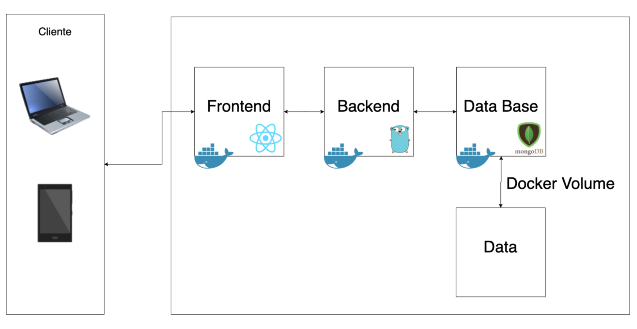

# SO1-Practica1-201900874

La práctica fue realizada con el fin de comprender y practicar docker mediante la utilización de sus comandos, realizando una calculadora sencilla con un registro de sus operaciones, todo el registro de operaciones cuenta con persistencia de datos mediante el uso de docker volumes.

# Indice
- [SO1-Practica1-201900874](#so1-practica1-201900874)
- [Indice](#indice)
- [Manual Técnico](#manual-técnico)
  - [Requerimientos](#requerimientos)
  - [Arquitectura](#arquitectura)
  - [Frontend](#frontend)
    - [Calculator](#calculator)
      - [Etiquetas](#etiquetas)
        - [Input Text](#input-text)
        - [Button](#button)
      - [Funciones](#funciones)
        - [changeValue](#changevalue)
        - [setOperation](#setoperation)
        - [getResult](#getresult)
        - [restartValues](#restartvalues)
      - [Uso React](#uso-react)
        - [Props](#props)
        - [useState](#usestate)
      - [Observaciones](#observaciones)
    - [TableLogs](#tablelogs)
      - [Etiquetas](#etiquetas-1)
        - [Table](#table)
        - [Thead](#thead)
        - [Tr](#tr)
        - [Th](#th)
        - [Tbody](#tbody)
        - [Td](#td)
      - [Funciones](#funciones-1)
        - [getOperations](#getoperations)
      - [Uso React](#uso-react-1)
        - [Props](#props-1)
        - [useState](#usestate-1)
      - [Observaciones](#observaciones-1)
  - [Backend](#backend)
    - [Librerias](#librerias)
      - [context](#context)
      - [encoding/json](#encodingjson)
      - [fmt](#fmt)
      - [io/ioutil](#ioioutil)
      - [log](#log)
      - [net/http](#nethttp)
      - [os](#os)
      - [time](#time)
      - [gorilla/mux](#gorillamux)
      - [mongo-driver/bson](#mongo-driverbson)
      - [mongo-driver/mongo](#mongo-drivermongo)
      - [mongo-driver/mongo/options](#mongo-drivermongooptions)
    - [Structs](#structs)
      - [operation](#operation)
      - [modelMongo](#modelmongo)
      - [modelMongoR](#modelmongor)
      - [listOperation](#listoperation)
    - [Funciones](#funciones-2)
      - [saveOperation](#saveoperation)
      - [home](#home)
      - [doOperation](#dooperation)
      - [getOperations](#getoperations-1)
      - [main](#main)
- [Manual de Usuario](#manual-de-usuario)

# Manual Técnico
## Requerimientos
- Tener instalado Golang v1.16.14 o superior
- Tener instalado Nodejs v16.13.1 o superior
- Tener instalado Npm v8.3.2 o superior
- Tener instalado Docker v20.10.12 o superior
- Tener instalado MongoDB o su contenedor

## Arquitectura
La aplicación se basa en la siguiente arquitectura: 

Donde la vista del cliente es manejada por el [Frontend](./frontend/), el cual se encuentra diseñado con [React](https://es.reactjs.org), todas las operaciones ingresadas por parte del usuario son enviadas mediante una petición POST al [Backend](./backend/), el cual fue realizado en [Golang](https://go.dev) y es el encargado de administrar la conexión entre el frontend y la base de datos en [MongoDB](https://www.mongodb.com/es).

Cada una de estas partes se encuentran administradas en [Docker Hub](https://hub.docker.com) para que sea más sencillas de ubicar y descargar para su utilizacón,  la base de datos utiliza [Docker Volumes](https://docs.docker.com/storage/volumes/) para una persistencia de datos.

## Frontend
Para la creación de la vista del usuario fueron utilizados dos componentes, los cuales se encuentran renderizados dentro de la página principal, dichos componentes se pueden encontrar dentro de la carpeta [components](./frontend/src/components/), sus estilos se encuentran dentro de la carpeta [css](./frontend/src/css/).

### Calculator 
Es el componente encargado de manejar y mostrar la calculadora al usuario, todo el código se encuentra dentro de [calculator.js](./frontend/src/components/calculator.js). 

#### Etiquetas

La calculadora se encuentra conformada por las siguientes etiquetas: 
##### Input Text
Es la encargada de mostrar los valores que el usuario se encuentra ingresando, así como también el resultado final obtenido.
```html
<input type="text" id="texto" value={values.num2} disabled />
```

##### Button
Son los encargados de registrar cada uno de los valores que el usuario desee, ya sean numeros, operaciones, eliminar u obtener el resultado. 
```html
<button className="fila0" id='cero' value='0' onClick={changeValue}>0</button>
```

#### Funciones
No solamente se necesitan las etiquetas para el funcionamiento de nuestro componente, también se hizo uso de varias funciones par cumplir con lo establecido, las funciones utilizadas son las siguientes: 

##### changeValue
Es la función encargada de capturar los valores que el usuario ingrese para los numeros que se involucren en la operación
```js
function changeValue(e) {
    ...
}
```

##### setOperation
Es la función encargada de definir cual será la operación a realizar con los numeros ingresados
```js
function setOperation(e) {
    ...
}
```

##### getResult
Es la función encargada de realizar la petición al backend, pasando cada uno de los argumentos solicitados para poder realizar la operación correcta y así obtener el resultado deseado.
```js
function getResult() {
    ...
}
```

##### restartValues
Es la función encargada de reiniciar todos los valores de la calculadora por alguna equivocación cometida.
```js
function restartValues() {
    ...
}
```

#### Uso React
Se hizo uso de ciertas caracteristicas que react proporciona, las cuales son: 

##### Props
Son los diferentes valores que puede adquirir un componentes según se vea necesario para cambiar ciertos atributos y tener que optimizar el código escrito.

##### useState
Es el comportamiento que tiene el componente durante su ciclo de vida, ya que durante su utilización su uso puede ir variando.
```js
const [values, setValues] = useState({
    num1: '',
    num2: '',
    operation: '',
    result: '',
    date: ''
})
```

#### Observaciones
- Cabe resaltar que las 4 [funciones](#funciones) hacen uso de setValues para modificar el estado del componente.
- La petición realizadad dentro de [getResult](#getresult) es de tipo 'POST' y se realiza mediante 'fetch' definiendo cada uno de sus atributos.

### TableLogs
Es el componente encargado de mostrar todo el registro de las operaciones ingresadas previamente y de las futuras, todo el código se encuentra dentro de [tableLogs.js](./frontend/src/components/tableLogs.js).

#### Etiquetas

La calculadora se encuentra conformada por las siguientes etiquetas: 
##### Table
Es la encargada de mostrar de forma ordenada todos los valores recuperados de la base de datos.
```html
<table>
    ...
</table>
```

##### Thead
Es la encargada de mostrar un encabezado dentro de la tabla generada. 
```html
<thead>
    ...
</thead>
```

##### Tr
Es la encargada de generar cada uno de las filas por las cuales estará conformada la tabla. 
```html
<tr>
    ...
</tr>
```

##### Th
Es la encargada de generar cada uno de las columnas del encabezado por las cuales estará conformado. 
```html
<th>
    ...
</th>
```

##### Tbody
Es la encargada mostrar el cuerpo de la tabla. 
```html
<tbody>
    ...
</tbody>
```

##### Td
Es la encargada generar cada una de las columnas del cuerpo por las cuales estará conformado. 
```html
<td>
    ...
</td>
```

#### Funciones
No solamente se necesitan las etiquetas para el funcionamiento de nuestro componente, también se hizo uso de varias funciones par cumplir con lo establecido, las funciones utilizadas son las siguientes: 

##### getOperations
Es la función encargada de recuperar cada uno de los valores proporcionados por el backend al hacer la consulta hacia la base de datos
```js
function getOperations() {
    ...
}
```

#### Uso React
Se hizo uso de ciertas caracteristicas que react proporciona, las cuales son: 

##### Props
Son los diferentes valores que puede adquirir un componentes según se vea necesario para cambiar ciertos atributos y tener que optimizar el código escrito.

##### useState
Es el comportamiento que tiene el componente durante su ciclo de vida, ya que durante su utilización su uso puede ir variando.
```js
const [operations, setOperations] = useState({
    operations: []
})
```

#### Observaciones
- Dentro de [getOperations](#getoperations) se uso uso de la función 'fetch' para realizar la petición de tipo 'GET' y así modificar el estado inicial.
- Se mapeo cada uno de los resultados obtenidos de la petición para poder obtener sus valores por separados y distribuirlos correctamente en la tabla.

Se hizo uso de un estado global dentro de [App.js](./frontend/src/App.js] para que al momento de realizar una nueva operación fuera posible actualizar la tabla de reportes, pasando como una propiedad a los dos componentes.
```js
const [reloadOperation, setOperation] = useState(false)
```

## Backend
Para todo el manejo de las operaciones ingresadas se creó un servidor con las rutas necesarias, tanto para la obtención de resultados como la conexión hacia la base de datos, el código se puede encontrar dentro de [main.go](./backend/main.go).

### Librerias
Fue necesario el uso de ciertas librerias para poder realizar el servidor e ir realizando las pruebas necesarias y verificar que todo se encontraba bien.

Las librerias utilizadas son: 

#### context
Ya que para realizar la conexión hacia MongoDB solicita pasar un contexto para funcionar correctamente, se procedio a utilizar esta libreria, utilizando especificamente 'context.TODO()', ya que no es tan necesario pasar algo especifico se usaba un contexto vacio.

#### encoding/json
Ya que no es tan sencillo trabajar archivos json en golang como en otros lenguajes se utiliza esta libreria para poder mapear los datos recibidos del body de la petición y así almacenarlos en una variable de un tipo especifico.

#### fmt
Fue utilizada para ir probando todas las funciones y ver en que parte ocurria algún error al momento de utilizar el servidor, también se utilizo para pasar ciertos parametros a las funciones como el link de la conexión a mongo y la respuesta de parte del servidor a la ruta inicial.

#### io/ioutil
Se utilizó para leer el cuerpo de la petición y obtener todos sus parametros dentro de una variable.

#### log
Se utilizó para terminar el servidor dado cualquier error y mostrarlo en pantalla para poderle dar una solución.

#### net/http
Se utilizó para poder realizar el servidor, ya que hay tipos de variables especificos para definir las funciones que van a ser utilizar en cada una de las rutas.

#### os
Se utilizó para poder leer una variable de entorno, ya que al momento de desplegarlo en docker es necesario utilizar la IP de la máquina, no basta solo con utilizar localhost.

#### time
Se utilizó para manejar las variables que almacenan la fecha en la cual se ejecutó una operación y poder almacenarla en la base de datos sin ningún problema.

#### gorilla/mux
Se utilizó para poder establecer el router de todo el servidor y así generar cada una de las rutas necesarias.

#### mongo-driver/bson
Se utilizó para los structs que se utilizan para la conexión a la base de datos, ya que no es como tal un archivo json, mongo nos proporciona esta herramienta para poder leer y mandar datos sin ningún problema.

#### mongo-driver/mongo
Se utilizó para obtener la conexión hacia la base de datos con los parametros requeridos y así devolver el cliente que se va a utilizar.

#### mongo-driver/mongo/options
Se utilizó para definir una serie de opciones que se solicitan al realizar una conexión a mongo o una consulta, así se definian en una variable todas las opciones y solamente se ingresa como parametro la variable.

### Structs
Para poder leer los archivos json que eran enviados desde el frontend y los almacenar o leer los datos en la base de datos fue necesario el uso de algunos structs, los cuales son:

#### operation
Es el struct encargado de mapear cada uno de los datos recibidos por el cuerpo de la petición y almacenarlos dentro de una variable para poder acceder a cada atributo sin problemas.
```golang
type operation struct {
	Num1   float32   `json:"num1"`
	Num2   float32   `json:"num2"`
	Option string    `json:"operation"`
	Result float32   `json:"result"`
	Date   time.Time `json:"date"`
}
```

#### modelMongo
Es el struct encargado de mapear cada uno de los datos que serán almacenados dentro de la base de datos, pero sin la necesidad de recibir un identificador y pueda ser asignado automáticamente por mongoDB.
```golang
type modelMongo struct {
	ID        string    `bson:"-"`
	Number1   float32   `bson:"number1"`
	Number2   float32   `bson:"number2"`
	Operation string    `bson:"operation"`
	Result    float32   `bson:"result"`
	Date      time.Time `bson:"date"`
}
```

#### modelMongoR
Es el struct encargado de mapear cada uno de los datos que serán devueltos por la base de datos junto con su respectivo identificador.
```golang
type modelMongoR struct {
	ID        string    `bson:"_id"`
	Number1   float32   `bson:"number1"`
	Number2   float32   `bson:"number2"`
	Operation string    `bson:"operation"`
	Result    float32   `bson:"result"`
	Date      time.Time `bson:"date"`
}
```

#### listOperation
Es el struct encargado de almacenar la lista de registros obtenidos de la base de datos con el tipo de struct que recopila junto con los identificadores.
```golang
type listOperation struct {
	Data []modelMongoR `json:"data"`
}
```

### Funciones
Se crearon varias funciones para servir en cada una de las rutas del servidor y llevar un mejor control, las funciones creadas son: 

#### saveOperation
Es la función encargada de servir a la ruta '/Operation', donde se recibe como parametro el conjunto de valores relacionados con una operación nueva y poder almacenarla con la estructura apropiada en la colección establecida.

```golang
func saveOperation(newOperation operation) {
	...
}
```

#### home
Es la función encargada de servir a la ruta principal y devolver un mensaje para asegurarnos que el servidor se encuentra corriendo

```golang
func home(w http.ResponseWriter, r *http.Request) {
	...
}
```

#### doOperation
Es la función encargada de servir a la ruta '/Operation', donde se recibirá y mapeará todo el cuerpo de la petición para posteriormente hacer uso de la función [saveOperation](#saveoperation) y devolver el resultado correcto.

```golang
func doOperation(w http.ResponseWriter, r *http.Request) {
	...
}
```

#### getOperations
Es la función encargada de servir a la ruta '/getOperations', donde se irá a consultar a la base de datos todas las operaciones realizadas y así devolver el listado como respuesta de la petición.

```golang
func getOperations(w http.ResponseWriter, r *http.Request) {
	...
}
```

#### main
Es la función encargada de ejecutar el servidor utilizando el router creado con [gorilla/mux](#gorillamux) y crear cada una de las rutas con su método establecido.

```golang
func main() {
	...
}
```

# Manual de Usuario
